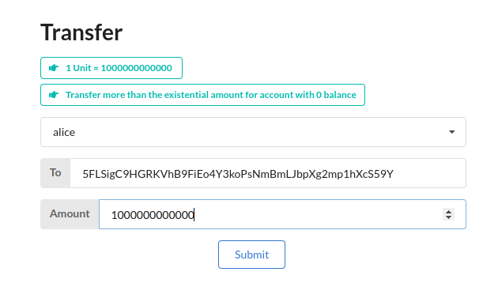
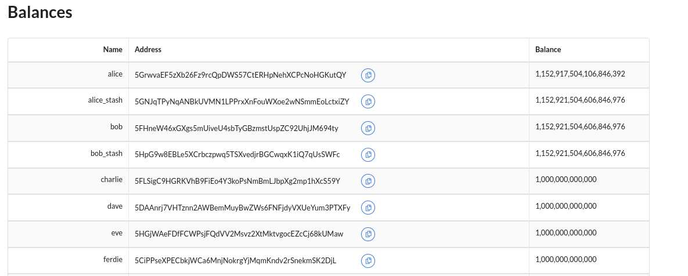
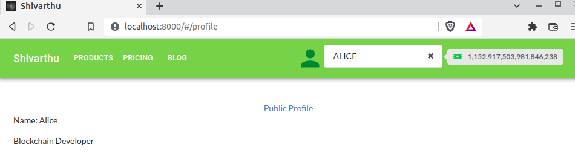
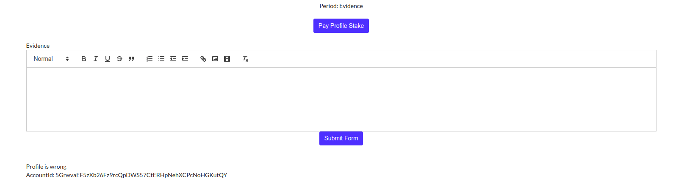
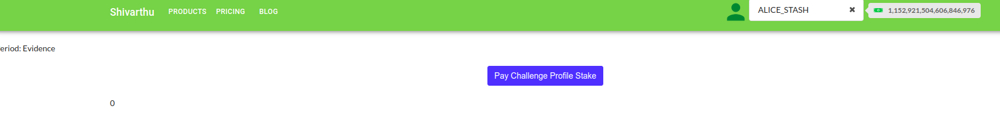
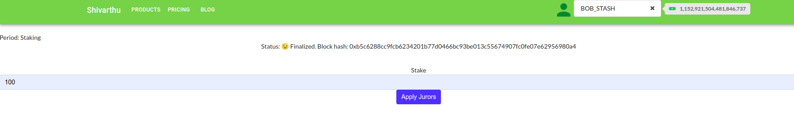
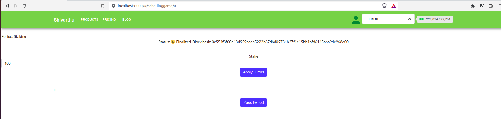
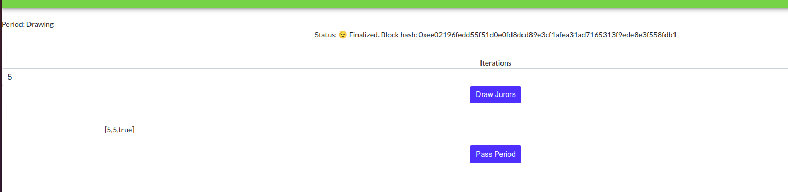
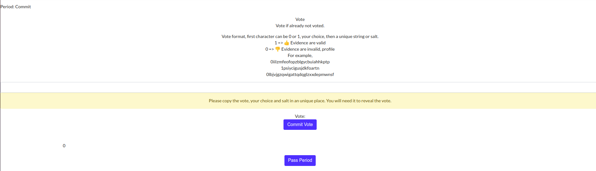
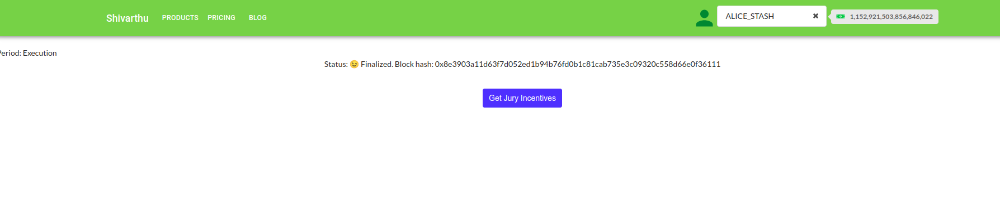

## Tutorial to test the app

Note: Code is in active development, styling and features will change.  

Distribute 1 Unit of tokens to charlie, dave, eve and ferdie

Go to addprofile link:  

http://localhost:8000/#/addprofile

Fill in the details and upload a small mp4 video. 

The video must contain the full Polkadot address of the submitter.
The submitter must say in English   
`I attest that I am a real human, and I am not already listed in this registry`

After submission page redirects to:

http://localhost:8000/#/profile

Click on Public Profile

http://localhost:8000/#/profile/0

Pay the profile stake:

If the profile is legitimate, submit evidence on another account. 

Go to schelling game to pay challenge profile stake:

http://localhost:8000/#/schellinggame/0

Click on `Pay challenge profile` to pay after the period for collecting evidence has expired.

Period time is set to 50 blocks (5 mins) for testing, it can be set to 3-10 days in case of development.

Now stake for jury, choose a different account using all the 7 acccounts:

Stake at least 100.

After all accounts have staked and staking period has passed, click on `Pass Period`

Draw with iterations of 5  

Draw till `[5,5,true]`, true means you can now pass the period. 

Then, pass the period to `Commit`.

Then commit your vote using different accounts.

e.g.  
Vote: `1profilevalidation`  
User: ALICE_STASH  

Vote: `1profilevalidation2`   
User: BOB  

Vote: `1profilevalidation3`
User: BOB_STASH

Vote: `0profilevalidation4`   
User: DAVE  

Vote: `0profilevalidation5`
User: EVE

Now pass period, to `Vote`  

Now vote, using your values commit.

If you commited `1profilevalidation` than choice `1` is salt `profilevalidation`

Then click `Get Jury Incentives` to get jury incentives for each account.

